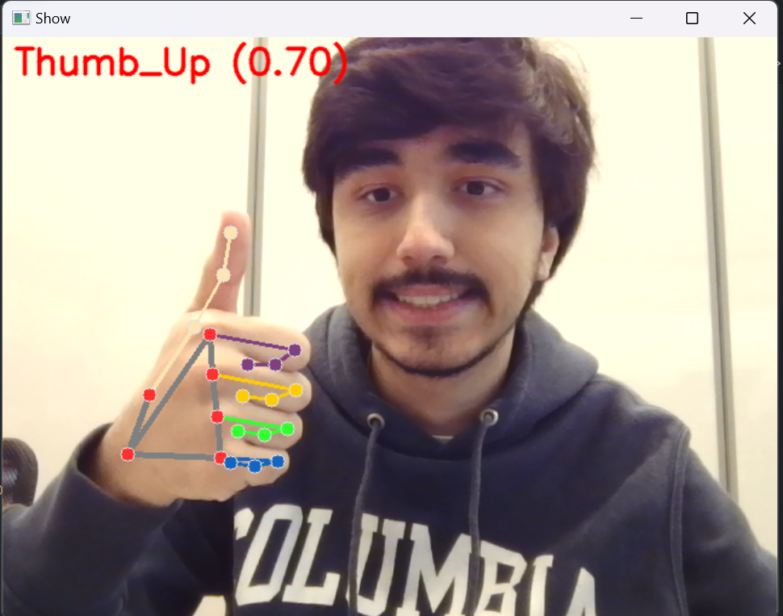

# Key Motions

## About

Key motions is a python library that allows you to control your keyboard with gestures, using your webcam. To do so, it uses the [mediapipe](https://developers.google.com/mediapipe) library to detect hand landmarks and pynput [https://pynput.readthedocs.io/en/latest/#] to control the keyboard.

## Install the project

### Create python environment:

`python -m venv .env`

### Activate the environment:

Windows:

`.env/Scripts/activate.bat`

Linux:

`sudo apt update`

`sudo apt upgrade -y`

`sudo apt install python3 python3-pip`

`source .env/bin/activate`

### Install requirements:

`pip install --upgrade -r requirements.txt`

`pip3 install --upgrade -r requirements.txt`


## Getting started

Key Motion is currently able to support 7 gestures: "✊", "👍", "👎", "✋", "✌️", "🤟", "☝️". Each gesture will represent a keyboard input, and the user will be able to redifine what key it gesture represents, the pressure type of the gesture ("hold", "press"), the time the gesture should be maintained for the key to pressed, the press type and how much time the key will be pressed if it of the type 'press'. 

The basic usage will be importing the lib, creating a `KeyMotion` instance and running:

    from keymotions import KeyMotions

    k = KeyMotions().run()

In this case the default values for each gesture will be used, that being:

    "👍": [type] hold, [key] Key.Up, motion_type: "hold", time_to_press: 0.5,
    "👎": [type] hold, [key] Key.Down, motion_type: "hold", time_to_press: 0.5,
    "✊": [type] hold, [key] Key.Left, motion_type: "hold", time_to_press: 0.5,
    "✋": [type] hold, [key] Key.Right, motion_type: "hold", time_to_press: 0.5,
    "✌️": [type] press, [key] "z", motion_type: "press", duration: 0.5, time_to_press: 0.5,
    "🤟": [type] press, [key] "x", motion_type: "press", duration: 0.5, time_to_press: 0.5,
    "☝️": [type] press, [key] "a", motion_type: "press", duration: 0.5, time_to_press: 0.5,


When you run the code above, your webcam (hopefully) will open, so you can easily see what gestures are being recognized:



    
In case the webcam isn't recongnized, you can redifine the index of your webcam when creating the KeyMotions object:

    KeyMotions(cam=2)

You can also redifine the FPS of the camera being displayed :

    KeyMotions(fps=100) # default value is 30 fps

To redefine what each gesture represents, you can use the `set_motions(motions: List[Motion])` method from KeyMotions. Motion is a dictionary that will be used to redifine the action of one of the 7 gestures supported:

    closed_fist_motion: Motion = {
        "name": "✊",
        "value": "d",
        "motion_type": km.PressMotion(name="press", duration=1),
        "time_to_press": 0.5,
    }

Now just call `set_motions(motions: List[Motion])` with the list of the gestures you want to redifine:


    KeyMotions().set_motions(motions=[closed_fist_motion, open_palm_motion])

If you don't want to define to use the lib though code, you can run the `demo.py` file. To change the deafult values of the gesture you can use a json file, with a list of objects in the same format as Motion:

    [
        {
            "name": "👍",
            "value": "a",
            "motion_type": {
                "name": "hold"
            },
            "time_to_press": 0.5
        },

        {
            "name": "✊",
            "value": "d",
            "motion_type": {
                "name": "press",
                "duration": 0.5
            },
            "time_to_press": 0.5
        }
    ]

    python demo.py mygesture.json

You can use KeyMotions lib to a various numbers of applications, as it is easy to integrate with any python project! For example, you can use it as the controller of your pokemon game:

    TODO Adicionar vídeo jogando pokemon

## API

#### KeyMotions(cam: int = 0, fps: int = 30, verbose = False)
Create a KeyMotions object, that will be used to run the key motion program.

Parameters:
- cam: int - The index of the webcam that will be used by the program. The default value is 0.
- fps: int - The FPS of the webcam that will be displayed. The default value is 30.
- fps: bool - The terminal mode of the lib, if True will print the gestures recognized. The default value is False.

#### KeyMotions.run()

Run the key motion program, start the webcam and detect hand landmarks, pressing the keys acording to the chosen mapping. To exit the program, press "q".

#### KeyMotions.set_motions(motions: List[Motion])

Set the motions of the program, that being the gestures that will be detected and the keys that will be pressed. The motions are a list of Motion objects, each one representing a gesture and the key that will be pressed when that gesture is detected.

Parameters:
- motions: List[Motion] - The list of motions that will be detected by the program.

Objects:
- Motion: The motion object represents a gesture and the key that will be pressed when that gesture is detected. It has the following attributes:
    - name: str - The gesture that will be detected.
    - value: KeyInput - The key that will be pressed when the gesture is detected.
    - motion_type: MotionType - The type of the gesture, that being "press" or "hold".
    - time_to_press: float - The time the gesture should be maintained for the key to be pressed.

- KeyInput: The key input object represents a key that will be pressed, it is imported from pynput.
  
- MotionType: The motion type object represents the type of the gesture, that being "press" or "hold".
    - name: str - The name of the motion type, that being "press" or "hold".
    - duration: int | None - The duration of the motion type, that being the time the key will be pressed in case of a "press" motion type. In case of a "hold" motion type, the duration will be None, it's not necessary to set it.

#### KeyMotions.set_motions_from_json(motions_json: str)

Read the motions from a json string and set them as the motions of the program. The motions are a list of Motion objects, each one representing a gesture and the key that will be pressed when that gesture is detected.

Parameters:
- json_string: str - The json file path that contains the motions.

Json file:
- The json file should be a list of Motion objects. The format of the json file is the same as the Motion object. Example:
```
[
    {
        "name": "👍",
        "value": "a",
        "motion_type": {
            "name": "hold"
        },
        "time_to_press": 0.5
    },

    {
        "name": "✊",
        "value": "d",
        "motion_type": {
            "name": "press",
            "duration": 0.5
        },
        "time_to_press": 0.5
    }
]
```
